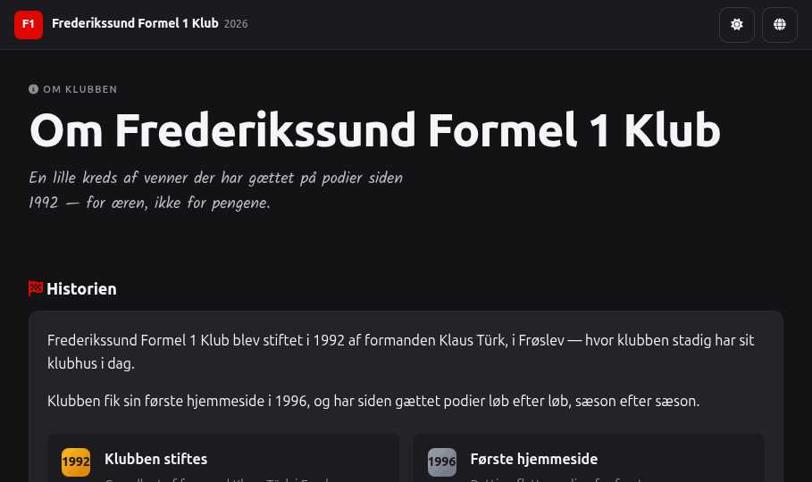
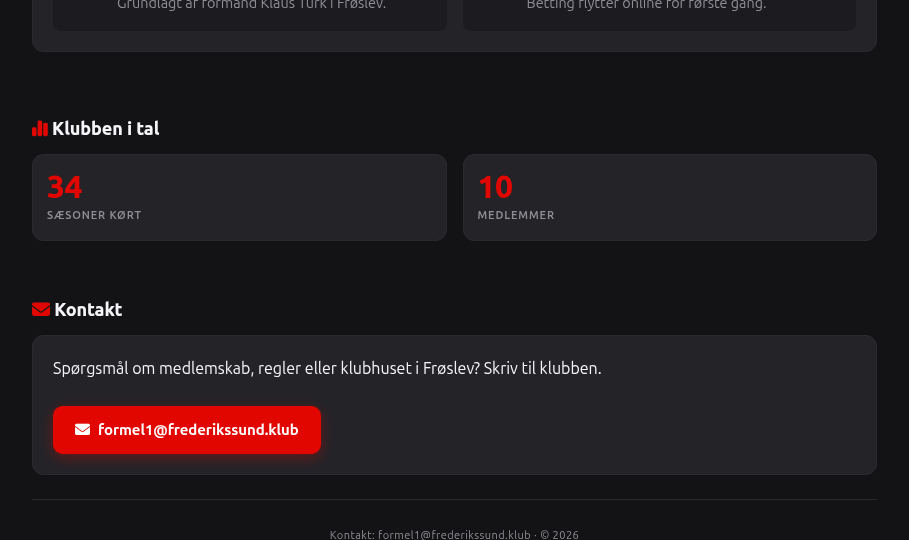
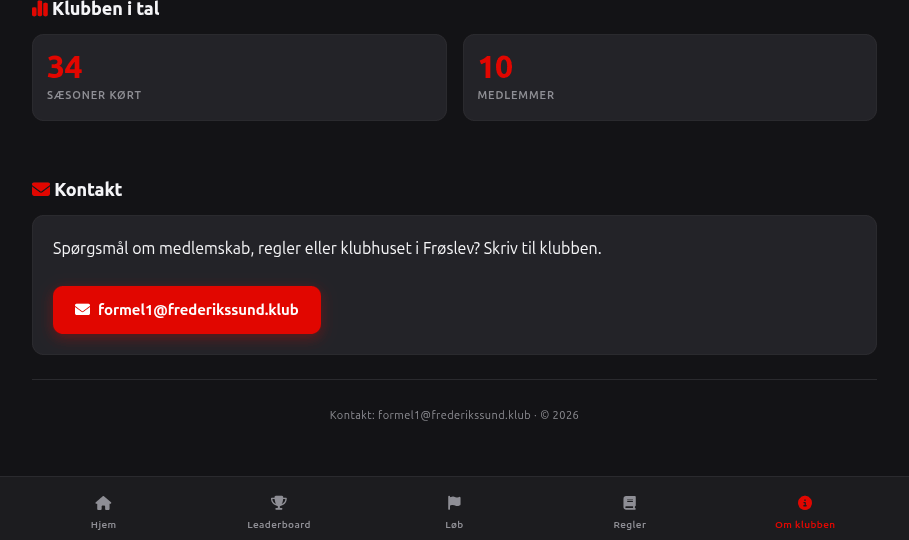

# Handoff: About Page (Frederikssund Formel 1 Klub)

## Overview
A new "About" / "Om klubben" page for the F1 betting site: club story (founded 1992 by Klaus Türk in Frøslev, first website 1996), stats-in-numbers, and contact info. Bilingual (DA default / EN toggle), dark-theme default, matches the existing site chrome (header, bottom nav).

## About the Design Files
The bundled file (`About.dc.html`) is a **design reference built in HTML**, not production code to copy in as-is. It's a prototype showing intended layout, copy, and behavior. Recreate it in the site's real stack — plain PHP + vanilla JS/CSS per the existing `F1Betting` codebase (`Djarnisdrengen/F1Betting` on GitHub), following the patterns already in `public/includes/header.php`, `public/*.php`, and `public/assets/css/style.css`. Do not ship the DC file itself.

## Fidelity
**High-fidelity.** Colors, type, spacing and component classes are pulled directly from the live design system (`colors_and_type.css`, `hifi/style.css`) — recreate pixel-for-pixel using the site's existing CSS classes/variables (`.hf-*`, `--f1-red`, `--bg-*`, etc. → map to whatever the equivalent live classes are in `style.css`).

## Screens / Views

### About page
- **Purpose:** Static informational page about the club — story, stats, contact.
- **Layout:** Same page shell as every other page: sticky top bar (logo + theme/lang toggles), scrollable content in a max-width container, bottom tab bar (mobile-style nav) with 5 items.
- **Sections, top to bottom:**
  1. **Page header** — small "About" crumb with `fa-circle-info` icon, `<h1>` title, one-line lede paragraph.
  2. **Story section** — heading with `fa-flag-checkered` icon (red). Two paragraphs of body copy. Below: a 2-column (auto-fit, min 220px) grid of two milestone cards, each with a big year "badge" (reusing the podium-rank chip look, red/gold gradient squares) + bold title + muted description:
     - 1992 — "Klubben stiftes" / "Club founded" — founded by chairman Klaus Türk in Frøslev.
     - 1996 — "Første hjemmeside" / "First website" — betting moved online.
  3. **Stats section** — heading with `fa-chart-simple` icon (red). 2-column (auto-fit, min 160px) grid of stat tiles, each: big red number (Chivo, 2rem, weight 900) + small muted label below:
     - (current year − 1992) → "Sæsoner kørt" / "Seasons run" (computed, not hardcoded)
     - member count → "Medlemmer" / "Members"
     Years/milestones (1992, 1996) live only in the History section above — not repeated here.
  4. **Contact section** — heading with `fa-envelope` icon (red). One row: contact blurb text on the left, a red/primary-styled `mailto:` button on the right (wraps to stack on narrow screens).
  5. **Footer strip** — "Contact: formel1@frederikssund.klub · © {year}", centered, muted.
- **Components:** page top bar, page header/crumb, section heading, milestone card, stat tile, primary CTA button/link, bottom tab bar — all built from the design system's existing `hifi/style.css` classes (`.hf-top`, `.hf-pageh`, `.hf-section`, `.hf-row`, `.hf-rank`, `.hf-stat`, `.hf-cta-primary`, `.hf-bottom`/`.hf-bb-item`). Map these onto whatever the live site's real header/nav/card partials are named.
- **Colors:** `--f1-red` (#e10600) for accent icons, numbers, and the year-badge gradients; `--bg-secondary` for milestone card backgrounds; `--text-primary` / `--text-muted` per design system.
- **Typography:** Chivo (display) for headings, numbers, and milestone titles; Manrope (body) for paragraphs and descriptions.
- **States:** No interactive states beyond the shared header (theme toggle, language toggle) and the standard link/button hover from the design system (color/shadow per DS spec — no new states introduced).

## Interactions & Behavior
- **Theme toggle** (sun/moon icon) — flips `dark`/`light` class on `<body>`, same as every other page.
- **Language toggle** (globe icon) — flips all page copy DA ⇄ EN, same mechanism as the rest of the site (reads from the shared `lang/user.php` string table — add the new keys there, see below).
- **Nav placement — "About" link:**
  - **Bottom tab bar** (mobile, 5-icon row): add as the 5th item, `fa-circle-info` icon, label "Om klubben"/"About" — sits after Home / Leaderboard / Races / Rules.
  - **Desktop header nav / burger menu:** add "About" as the **last item** in the primary nav list, after Rules, before the Login/Profile control. In the hamburger/mobile-drawer menu (see `header.php`), insert the same link as the last nav item in the drawer's link list, using the existing drawer link markup/classes (icon + label, same row style as Home/Leaderboard/Races/Rules) so it's visually indistinguishable from the others.
  - No new top-level nav concept — this is a peer of the existing 4 nav items, not a sub-menu.
- No forms, no data fetching — this page is fully static aside from the shared theme/lang toggles and the computed "seasons run" number.

## State Management
- Reuses whatever global state/cookie the site already uses for theme and language (no new state needed).
- One derived value: `seasonsRun = currentYear - 1992`. Compute server-side (PHP) or client-side from the existing "current year" helper already used elsewhere on the site (e.g. footer copyright year).
- One value: `memberCount` — currently hardcoded (10) in the design reference; wire to the real member/user count from the DB in production.

## Design Tokens
- **Colors:** `--f1-red: #e10600`, `--f1-red-light` (hover), background ramp `--bg-primary` / `--bg-secondary` / `--bg-card` / `--bg-hover` (dark: `#0a0a0b → #141416 → #1a1a1d → #242428`; light: `#f0f0f2 → #e5e5e8 → #f8f8fa → #dcdce0`), `--text-primary` / `--text-secondary` / `--text-muted`.
- **Type:** Chivo 700–900 (headings/numbers/buttons), Manrope 400–500 (body), 600 for labels. Body line-height 1.6, heading line-height 1.15.
- **Radii:** `--radius-md: 8px` (milestone/stat cards), `--radius-lg: 12px` (larger cards), `--radius-pill` for any badge.
- **Spacing:** 4pt/rem base; sections stack at `1.5rem`+; card padding `1.25rem`.
- **Shadows:** none at rest; only the shared DS hover shadows apply to any interactive element on this page (there are none new here).

## Content requirement — Admin "edit all texts" settings page
The user wants a **settings page in the core admin area** to edit all site copy (not just the About page) — i.e. a CMS-lite for the bilingual string table.
- **Where:** add alongside the existing admin surface (the `fa-cog` / Admin nav item — likely `public/admin.php` or equivalent in the codebase). Add a new admin sub-page, e.g. `admin_texts.php` (or a tab within the existing admin page), linked from the admin nav/menu.
- **Data source:** the site's copy currently lives in `public/lang/user.php` (a DA/EN string table used across pages, including this new About page's copy). The settings page should read that same table and render one editable field per key, grouped by page/section (e.g. "About page", "Nav", "Races", "Rules") with a DA and EN column per row.
- **Behavior:** on save, persist back to wherever `lang/user.php` sources its data — if it's currently a flat PHP array, either (a) migrate it to a small DB table (`site_text(key, lang, value)`) so admin edits persist without redeploying code, or (b) if staying file-based, have the admin form write the updated PHP array back to `lang/user.php` server-side. Recommend (a) — DB-backed strings — since editing PHP source from a web form is fragile and requires filesystem write access in production.
- **Access control:** gate this page behind whatever auth already protects the existing admin area — no new auth pattern needed.
- **New About-page string keys to add to the table:** `about.hero_title`, `about.hero_text`, `about.story_title`, `about.story_p1`, `about.story_p2`, `about.milestone1_title`, `about.milestone1_text`, `about.milestone2_title`, `about.milestone2_text`, `about.stats_title`, `about.stat_seasons`, `about.stat_members`, `about.contact_title`, `about.contact_text`, `about.nav_label` (DA "Om klubben" / EN "About") — DA/EN values as shown in the design file's logic class.

## Assets
No new images/icons beyond existing Font Awesome 6 Free icons already used site-wide: `fa-circle-info`, `fa-flag-checkered`, `fa-chart-simple`, `fa-envelope`, `fa-home`, `fa-trophy`, `fa-flag`, `fa-book`.

## Screenshots

## Files
- `About.standalone.html` — **open this one** to view the design reference in any browser (self-contained, no build step).
- `About.dc.html` — the original editable design source (for reference only, requires the design tool's runtime to render — don't open directly).
- `screenshots/` — static captures of the design for quick reference without opening the HTML.
